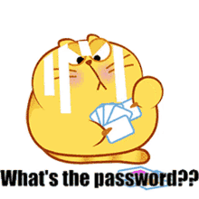
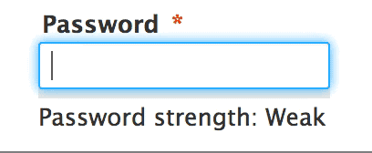
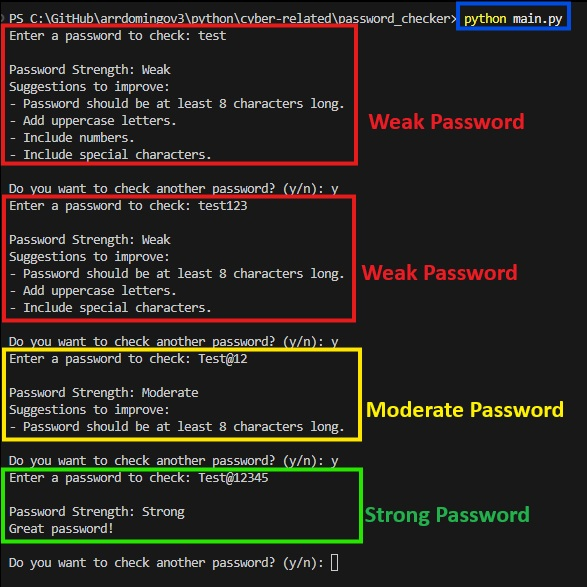

# Password Checker

Here’s a simple Python password strength checker. It evaluates a password based on common security rules:

Length

Uppercase letters

Lowercase letters

Numbers

Special characters

It then classifies the password as Weak / Moderate / Strong / Very Strong.

# How to run

Open the terminal and type `python main.py`.

# Test Results

